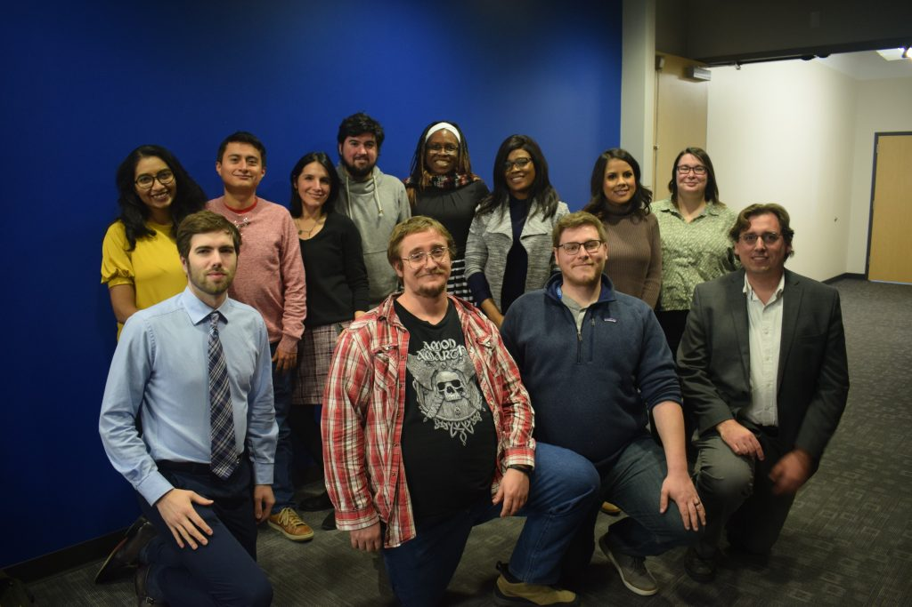

The People and Information Research Team (PIReT, pronounced "pirate") studies information retrieval, 
recommender systems, and other intelligent information systems. We are 
particularly interested in building compelling new applications focused on 
the needs of their users; understanding the ways in which these systems, 
their users, and society affect each other; and promoting high-quality, 
reproducible research on recommender systems.

PIReT is a part of the [Department of Computer Science](https://coen.boisestate.edu/cs/) 
in the [College of Engineering](https://coen.boisestate.edu/) at 
[Boise State University](https://www.boisestate.edu/) and is led 
by [Sole Pera and Michael Ekstrand](/people/#faculty).

-   [Follow the PIReT Ship on Twitter](https://twitter.com/intent/follow?screen_name=PIReTship).
-   [Read about our current projects](http://piret.info/projects/)

<figure class="text-center half">
  
</figure>