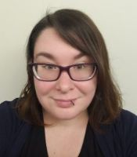

## Current Students

{::comment}
The student list is below.  The styles controlling its formatting are in `_sass/students.scss`. It
automatically takes care of laying out the alternating picture display.
{:/comment}

{: .student-list}

-   
    {: .pic}

    **Ashlee Milton** is a senior working on a second bachelor’s degree in computer science and will be continuing at Boise State in the master’s program starting spring 2020. Her first degree is in psychology from the University of Idaho. She works as an undergraduate research assistant for Dr. Pera working on subjects related to information retrieval with underrepresented populations.

-   
    {: .pic}

    My name is **Devan Karsann** and I’m a first year master’s student in Computer Science. Dr. Sole Pera is my advisor and next semester I’m looking forward to starting my graduate project. I have a data set available to use and soon it will soon be time to defend the project proposal! During the school year I work 30 hours a week at AppDetex, a software startup in downtown Boise. This gives me to take 6 credits a semester and I’m happy about the balance. Right now I’m taking Introduction to Information Retrieval and Large-Scale Data Analysis and they’re both cool classes. My personal website can be found at <http://www.devankarsann.com>.

-   
    {: .pic}

    **Lawrence Spear** is a PhD student in Computer Science, working with Dr. Maria Soledad Pera. Before joining the PIReT Team, he had worked in industry for 20 years. Throughout his career, he has done R&D in the latest techniques in the industry whether it is more process oriented, such as Agile, Behavior Driven Development and Continuous Deployment; or more technical oriented, such as Machine Learning, Infrastructure as Code or .Net Core. His general research interest is information retrieval, such as how children discover new information and how different search engines have to handle non-Latin-based languages. He also has an intense passion for learning new knowledge and broadening his horizons.

-   
    {: .pic}

    **Michael Green** is a Second year Masters candidate in the Computer Science Department at Boise State. He received his Bachelors in English with a focus in Literature with a minor in Visual Art from Boise State University in 2008. He currently works as a Research Assistant with Dr. Sole Pera on subjects such as user type identification as well as evaluating Search Engine effectiveness in the classroom environment. He is also working on his 5th semester as a TA and Tutor for the Computer Science Department.

## Alumni

**Axel Magnuson (M.Sc.)**   *Evaluation of Topic Models for Content-Based Popularity Prediction on Social Microblogs*

**Deepa Mallela (M.Sc.)**   *CEST: City Event Summarization using Twitter*

**Nevena Dragovic (M.Sc.)**   *Curating Recommendations to Satisfy User's Needs and Expectations*

**Ion Madrazo Azpiazu (M.Sc.)**   *First Steps Towards Multilingual Readability Assessment*

**Oghenemaro Anuyah (M.Sc.)**   *Fostering the Retrieval of Suitable Resources in Response to Children Educational Search Tasks*

**Jennifer Ekstrand (M.Sc.)**

**David McNeill (B.Sc.)**

**William Bigirimana (B.Sc.)**

**Daniel Bakyono (B.Sc.)**
