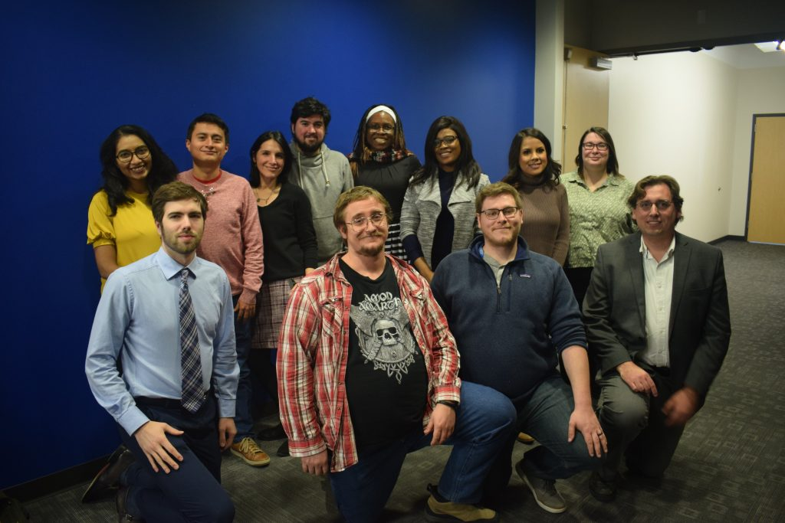
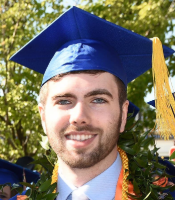
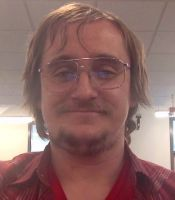

# People

<figure class="half text-center">
  
  <figcaption>People and Information Research Team</figcaption>
</figure>

## Faculty

<figure class="half text-center">
  
  <figcaption>
  <a href = "https://md.ekstrandom.net/">Michael Ekstrand</a>
  and <a href ="https://solepera.github.io/">Sole Pera</a></figcaption>
</figure>

## Current Students

{::comment}
The student list is below.  The styles controlling its formatting are in `_sass/students.scss`. It
automatically takes care of laying out the alternating picture display.
{:/comment}

{: .student-list}
-   **Adam Keener** is a MS student working with Dr. Ekstrand on applying Bayesian
    analysis to recommender systems. In his spare time, Adam spends time with 
    his wife and two children, and enjoys reading sci-fi and fantasy novels.

-   
    {: .pic}

    **Ashlee Milton** is a senior working on a second bachelor’s degree in computer science and will be continuing at Boise State in the master’s program starting spring 2020. Her first degree is in psychology from the University of Idaho. She works as an undergraduate research assistant for Dr. Pera working on subjects related to information retrieval with underrepresented populations.

-   
    {: .pic}

    **Amifa Raj** is a second year PhD student in Computer Science at Boise State University, She is working with Dr. Michael Ekstrand on research involved recommender systems. The main focus of her research is on content based recommendation. She is currently working on identifying and understanding biases introduced by the technique that exploit reviews in developing recommender systems. She completed her Bachelor’s in Computer Science and Engineering from the University of Dhaka, Bangladesh. She has been an active member of the People and Information Research Team (PIReT) from Fall 2018.

-   
    {: .pic}

    **Carlos Segura** is a first year Masters candidate in the Computer Science Department at Boise State. He received his Bachelors in Systems Engineering from Universidad Abierta Interamericana, Argentina. He is a Software Developer with more than 10 years of experience. He is currently working with Dr. Michael Ekstrand on Recommender Systems.

-   
    {: .pic}

    My name is **Devan Karsann** and I’m a first year master’s student in Computer Science. Dr. Sole Pera is my advisor and next semester I’m looking forward to starting my graduate project. I have a data set available to use and soon it will soon be time to defend the project proposal! During the school year I work 30 hours a week at AppDetex, a software startup in downtown Boise. This gives me to take 6 credits a semester and I’m happy about the balance. Right now I’m taking Introduction to Information Retrieval and Large-Scale Data Analysis and they’re both cool classes. My personal website can be found at <http://www.devankarsann.com>.

-   
    {: .pic}

    I am [**Ion Madrazo Azpiazu**](https://ionmadrazo.github.io/), a PhD candidate at Boise State University, USA, mentored by Dr. Maria Soledad Pera. My research area includes Natural Language Processing, Information Retrieval, and Machine Learning, with an emphasis on multi- and cross-lingual scenarios. I completed my Bachelor’s degree in Computer Science, as well as my Master’s degree in Intelligent Systems and Computation at the University of the Basque Country, where I actively collaborated with IXA NLP research group. I have also collaborated with Zalando Research and I am currently an active member of People and Information Research Team (PIReT).

-   
    {: .pic}

    **Michael Green** is a Second year Masters candidate in the Computer Science Department at Boise State. He received his Bachelors in English with a focus in Literature with a minor in Visual Art from Boise State University in 2008. He currently works as a Research Assistant with Dr. Sole Pera on subjects such as user type identification as well as evaluating Search Engine effectiveness in the classroom environment. He is also working on his 5th semester as a TA and Tutor for the Computer Science Department.

-   
    {: .pic}

    **Ngozi Ihemelandu** is a second year PhD student in Computing with an emphasis in Data science at Boise State University. She received her Master’s in Software Engineering from Texas State University, San Marcos and she is currently working with Dr. Michael Ekstrand on Recommender Systems.

-   
    {: .pic}

    **Sandra Ambriz** is a senior in the Computer Science program at Boise State. She currently works as an undergraduate research assistant with Dr. Michael Ekstrand. Currently, her research focuses on recommender system stability. In her free time, she enjoys going running, painting, and spending time with her dogs.

### Additional Students

- Jason Hall (MS)

## Alumni

- Ion Madrazo Azpiazu (Ph.D 2019)
- Mucun Tian (MS 2019)
- Oghenemaro Anuyah (MS 2018)
- David McNeill (BS 2016)
- Nevena Dragovic (MS 2016)
